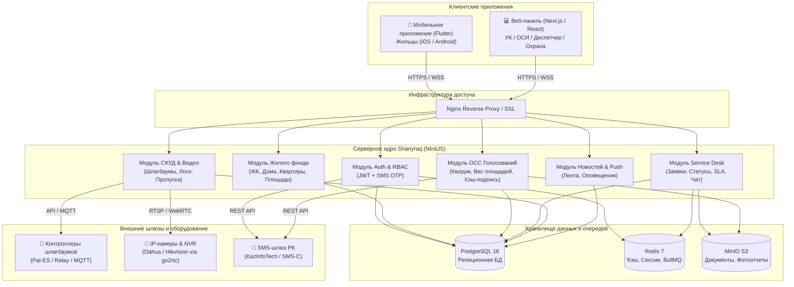
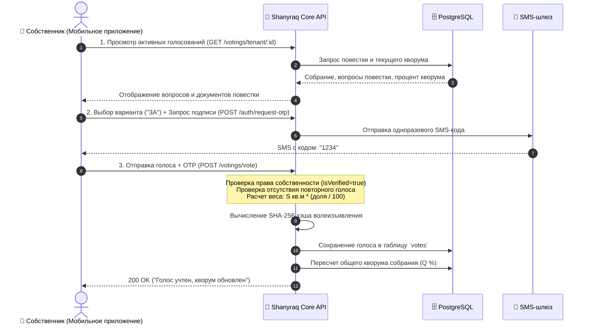
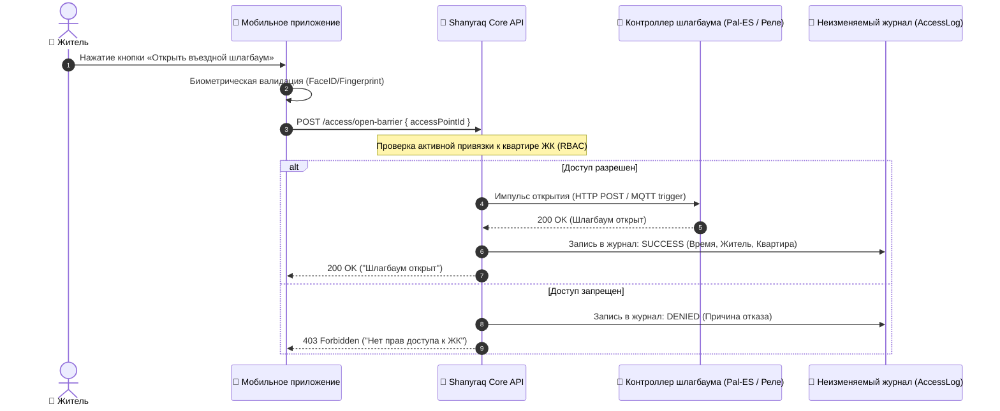

# Архитектура платформы «Shanyraq» (Шаңырақ)

Документ описывает техническую и системную архитектуру платформы «Shanyraq», алгоритмы взаимодействия компонентов, структуру базы данных и последовательности бизнес-процессов.

---

## 1. Системная архитектура (C4 Container View)

---

## 2. Диаграмма последовательности: Голосование на общем собрании (ОСС)

В соответствии с Законом РК «О жилищных отношениях», один собственник обладает весом голоса, строго равным полезной площади его квартиры ($м^2$).

---

## 3. Диаграмма последовательности: Открытие шлагбаума и аудит

